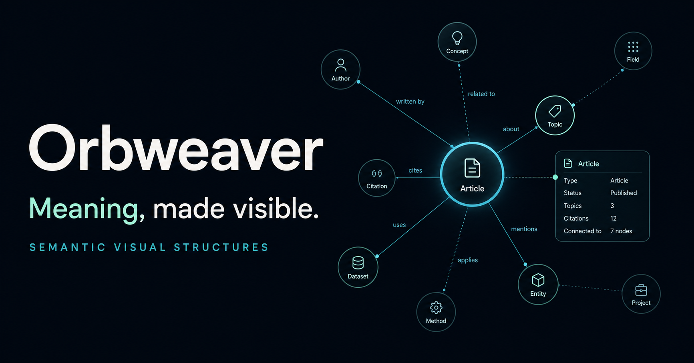

# Orbweaver

> Semantic visual structures for declarative systems.



Orbweaver is a framework-independent TypeScript library for turning semantic
graphs into inspectable, accessible visual structures.

> **Authors declare meaning. Orbweaver owns geometry.**

Orbweaver is currently an early architectural prototype. The v0.1 work is
focused on a plain-data graph contract, deterministic derived layout, polished
SVG rendering, provenance preservation, and a small interaction model.

## Install

```sh
npm install @semanticintent/orbweaver
```

## Current status

Phases 0–8 are complete. The semantic graph, validation, normalization, ELK
layered layout, renderer-independent scene model, accessible SVG renderer,
light and dark themes, semantic graph queries, provenance-aware inspection,
keyboard/pointer interaction, tests, build, and public repository foundation
are in place and published as the v0.1 line. Phase 9 formalizes AI-assisted
semantic visualization without coupling the core to an AI provider. See the
[implementation roadmap](docs/roadmap.md) for completed gates and future work.


Run the complete interactive gallery locally:

```sh
npm run examples:generate
npm run examples:serve
# http://127.0.0.1:4173
```

## Quick start

Create a semantic graph, validate it, and render an accessible SVG. Orbweaver
derives all coordinates and paths—the graph contains meaning only.

```ts
import { writeFile } from 'node:fs/promises'
import {
  createGraph,
  darkTheme,
  renderGraph,
  validateGraph,
} from '@semanticintent/orbweaver'

const graph = createGraph({
  id: 'checkout',
  title: 'Checkout flow',
  nodes: [
    { id: 'cart', type: 'process', label: 'Cart' },
    { id: 'payment', type: 'decision', label: 'Payment accepted?' },
    { id: 'fulfillment', type: 'process', label: 'Fulfillment' },
  ],
  edges: [
    { from: 'cart', to: 'payment', type: 'flow' },
    { from: 'payment', to: 'fulfillment', label: 'Yes' },
  ],
})

const validation = validateGraph(graph)
if (!validation.valid) {
  throw new Error(JSON.stringify(validation.errors, null, 2))
}

const svg = await renderGraph(graph, {
  layout: { direction: 'LR' },
  render: { theme: darkTheme },
})

await writeFile('checkout.svg', svg)
```

Run the example as an ES module with Node.js 20 or newer, then open
`checkout.svg` in a browser. For separate layout and rendering stages, custom
themes, semantic queries, and interaction, see the [Public API](docs/api.md).

## Development

```sh
npm install
npm run check
```

Contributions are welcome. Read [Contributing](CONTRIBUTING.md), the
[Code of Conduct](CODE_OF_CONDUCT.md), and the [Security Policy](SECURITY.md)
before participating. Please report vulnerabilities privately rather than in a
public issue.

## Architecture

```text
Application data
      ↓
Semantic graph
      ↓
Validation and normalization
      ↓
Layout adapter
      ↓
Positioned scene
      ↓
SVG renderer
```

The semantic graph never contains coordinates, SVG paths, CSS declarations,
or layout-engine-specific objects.

## Documentation

- [Architecture](docs/architecture.md)
- [Visual language](docs/visual-language.md)
- [Interaction and inspection](docs/interaction.md)
- [Public API](docs/api.md)
- [Release process](docs/releasing.md)
- [Implementation roadmap](docs/roadmap.md)
- [AI-assisted semantic visualization](docs/ai-assisted-semantic-visualization.md)
- [Reference proposal generator](docs/reference-generator.md)
- [Original prototype specification](ORBWEAVER_SPEC.md)
- [Project philosophy and biomimicry](ORBWEAVER_BIOMIMICRY.md)
- [Future RECALL integration](ORBWEAVER_RECALL_INTEGRATION.md)

## Non-goals for v0.1

Orbweaver is not a freeform editor, whiteboard, dashboard toolkit, charting
library, or manual vector-authoring system. RECALL integration is deliberately
deferred until the standalone core is stable.

## License

[MIT](LICENSE)
